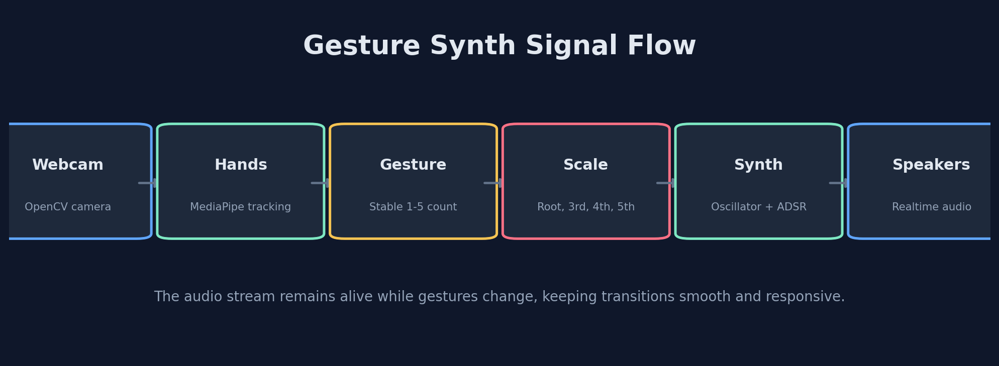
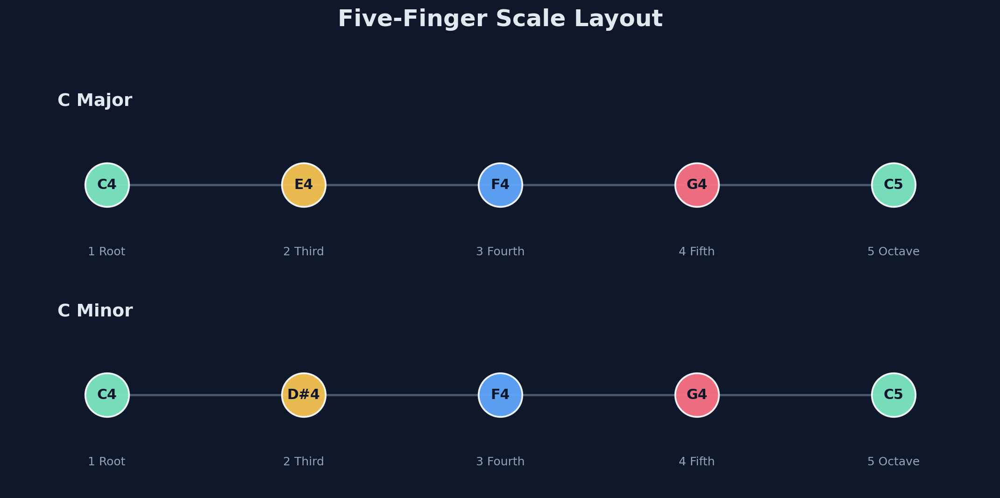
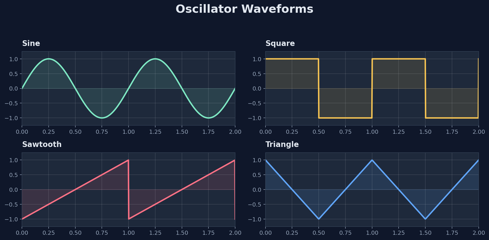
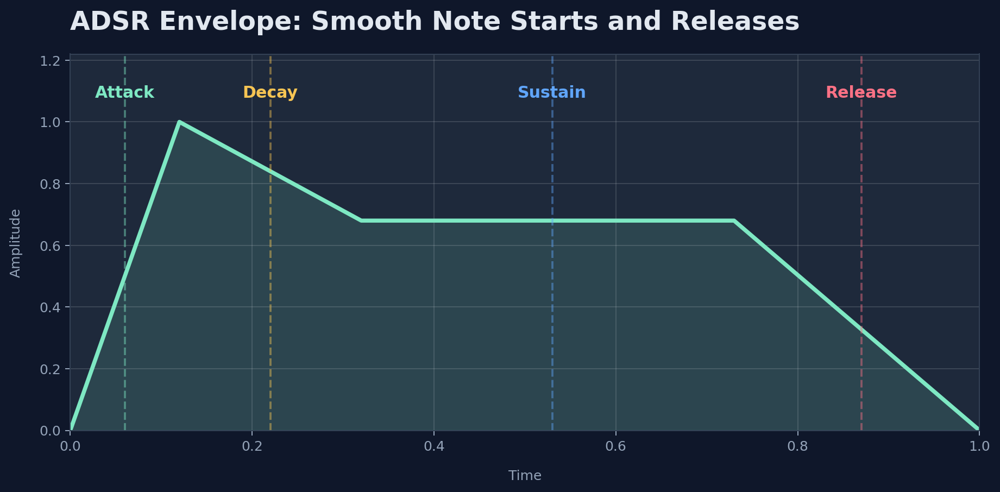
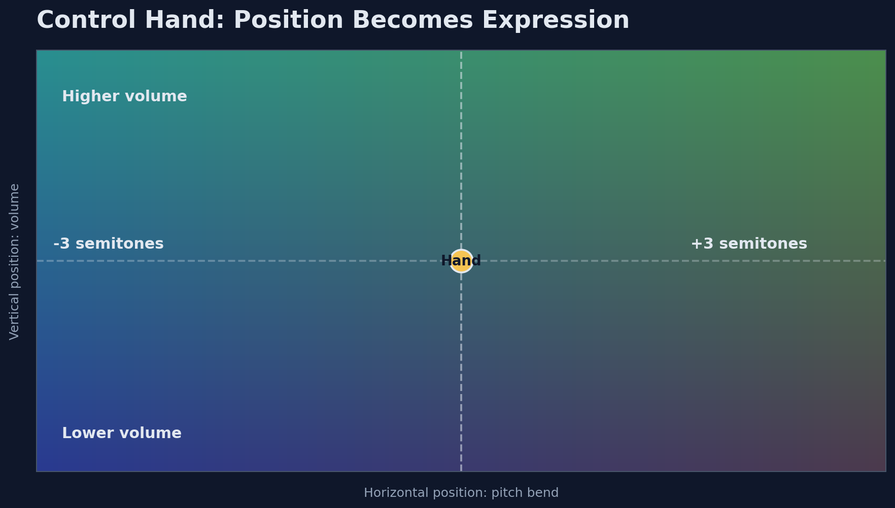

# Gesture Synth Python

A webcam-driven software synthesizer built in Python. Play a five-position major or minor scale with one hand, then use the other hand for expressive volume and pitch control.

This project is inspired by the browser-based reference at <https://gesture-synth-weld.vercel.app/> and is designed as a clean Python portfolio repo that runs from VS Code, a standard terminal, or a Jupyter notebook.

## Demo

The desktop app includes a **Save screenshot** button that captures only the running Gesture Synth window to `assets/screenshots/`. Add your own recorded runtime captures here after a performance:

- GIF demo: `assets/screenshots/demo.gif`
- Screenshot: `assets/screenshots/main-window.png`

## How It Works Visually





| Synth waveform choices | ADSR note envelope |
| --- | --- |
|  |  |



## Features

- Realtime webcam hand tracking with MediaPipe Hands
- Two-hand MediaPipe tracking with dedicated playing and control roles
- Professional dark-mode performance studio with Scale, Notes, and Chords modes
- Five editable note slots for direct per-gesture note selection
- Five editable chord slots mapped directly to gestures one through five
- Debounced gesture state so notes do not retrigger every frame
- Continuous polyphonic audio stream with real oscillators, not prerecorded files
- Sine, square, sawtooth, and triangle waveforms
- ADSR envelope with attack, decay, sustain, and release
- Portamento-style frequency glide to reduce clicks when changing notes
- Persistent desktop performance UI with landmarks, gesture, note, frequency, waveform, stability, and FPS
- Scale root and Major/Minor selection directly in the desktop UI
- Left-hand height controls volume and horizontal position controls pitch bend
- JSON configuration for camera, synth, gesture stabilization, scales, and two-hand controls
- Tests for gesture stabilization, finger counting, and synth rendering
- Jupyter notebook for waveform and hand-tracking experiments

## Gesture Mapping

The playing hand uses index through pinky for gestures one through four. The thumb is intentionally ignored for those common gestures so a partly open thumb does not turn `1` into `2`; a fully open hand is gesture five.

In **Scale** mode, select a root and Major or Minor in the top performance deck. The five-position layout adapts musically:

| Gesture | Note | Frequency |
| --- | --- | --- |
| 1 finger | Root | C4 in C Major or C Minor |
| 2 fingers | Third | E4 in C Major, D#4 in C Minor |
| 3 fingers | Fourth | F4 |
| 4 fingers | Fifth | G4 |
| 5 fingers | Octave | C5 |

Unsupported gestures, including no hand or an unmapped finger count, smoothly release the active note.

## Note Mode

Select **Notes** to open five editable note slots. Each slot has a chromatic picker from C3 through B5, so you can build your own melody or custom scale without editing code:

| Gesture | Default note slot |
| --- | --- |
| 1 finger | C4 |
| 2 fingers | E4 |
| 3 fingers | F4 |
| 4 fingers | G4 |
| 5 fingers | C5 |

## Chord Mode

Select **Chords** in the top performance deck to turn gestures one through five into polyphonic chord triggers. Each slot is editable from the chord rack, with these available qualities:

- Major, Minor, Sus2, Sus4
- Major 7, Minor 7, Dominant 7

The default slots form a playable C Major progression:

| Gesture | Default chord | Synth notes |
| --- | --- | --- |
| 1 finger | C Major | C4, E4, G4 |
| 2 fingers | D Minor | D4, F4, A4 |
| 3 fingers | F Major | F4, A4, C5 |
| 4 fingers | G Major | G4, B4, D5 |
| 5 fingers | A Minor | A4, C5, E5 |

The continuous audio stream remains active while the chord changes, releasing the prior chord smoothly and keeping the new chord responsive.

## Two-Hand Controls

- **Right hand (PLAY):** Use one to five fingers for Root, Third, Fourth, Fifth, and Octave.
- **Left hand (CONTROL):** Move up/down for volume and left/right for pitch bend.
- Hand roles, pitch-bend range, minimum volume, root, and initial scale are configurable in `config.json` under `music`.

If the camera view feels reversed, swap `music.playing_hand` and `music.control_hand` in `config.json`. MediaPipe labels describe your physical hands, while the displayed image is mirrored like a normal webcam preview.

## Project Structure

```text
gesture-synth-python/
├── assets/
│   └── screenshots/
├── notebooks/
│   └── gesture_synth_experiments.ipynb
├── src/
│   ├── camera.py
│   ├── config.py
│   ├── gesture_detector.py
│   ├── hand_tracker.py
│   ├── synth.py
│   └── ui.py
├── tests/
│   ├── test_gesture_detector.py
│   └── test_synth.py
├── config.json
├── main.py
├── requirements.txt
└── README.md
```

## Setup

Python 3.9 through 3.11 is recommended. On Windows, use the VS Code terminal or PowerShell.

Create a virtual environment:

```bash
python -m venv .venv
```

Activate it on Windows PowerShell:

```powershell
.\.venv\Scripts\Activate.ps1
```

Activate it on Windows Command Prompt:

```bat
.\.venv\Scripts\activate.bat
```

Activate it on macOS or Linux:

```bash
source .venv/bin/activate
```

Install dependencies:

```bash
pip install --upgrade pip
pip install -r requirements.txt
```

## Run

Start the full webcam and audio app. This opens the persistent Gesture Synth desktop window, which contains the live camera preview, landmarks, audio controls, waveform selector, and note status:

```bash
python main.py
```

Run the camera and gesture UI without audio:

```bash
python main.py --no-audio
```

Use a different config file:

```bash
python main.py --config path/to/config.json
```

Use the **Close** button or the standard window close control to quit the desktop app.

## Configuration

Edit `config.json` to change:

- `camera.index`, `camera.backend`, `camera.width`, `camera.height`, and `camera.fps`
- `gesture.stable_frames` and `gesture.max_num_hands`
- MediaPipe confidence thresholds
- `synth.waveform`, `synth.amplitude`, ADSR values, and portamento
- `music.root`, `music.scale`, hand roles, pitch bend range, and minimum volume
- `music.performance_mode` to start in `"scale"`, `"notes"`, or `"chords"`
- `music.note_slots` to persist five direct note choices
- `music.chord_slots` to persist five root/quality chord choices

Example waveform options:

```json
"waveform": "triangle"
```

Example starting configuration for a D Minor two-hand instrument:

```json
"music": {
  "root": "D",
  "scale": "minor",
  "playing_hand": "Right",
  "control_hand": "Left"
}
```

## Architecture

`main.py` coordinates the realtime loop:

1. `Camera` reads frames from OpenCV.
2. `HandTracker` detects and labels both hands with MediaPipe landmarks.
3. The playing hand's finger count is debounced by `GestureStabilizer`.
4. The selected Scale, Notes, or Chords performance mode maps the stable gesture to a sound.
5. The control hand maps height to volume and horizontal position to pitch bend.
6. `Synthesizer` starts, releases, or glides mono notes and polyphonic chords without recreating the audio engine.
7. The dark desktop performance UI renders camera landmarks, roles, note/chord controls, mapping, and FPS.

The synth is monophonic for the MVP, but the modules are separated so future two-hand control can be added without rewriting the camera, gesture, or oscillator layers.

## Jupyter Notebook

Launch Jupyter:

```bash
jupyter notebook
```

Open:

```text
notebooks/gesture_synth_experiments.ipynb
```

The notebook includes waveform visualization and a webcam landmark debugging loop.

## macOS App and DMG

The project includes [requirements-macos.txt](requirements-macos.txt) and [build_macos_dmg.sh](scripts/build_macos_dmg.sh) for packaging the app on a Mac. PyInstaller creates operating-system-specific applications, so build the `.dmg` on macOS rather than Windows.

On a Mac, from the repository root:

```bash
bash scripts/build_macos_dmg.sh
```

The script creates both:

```text
dist/Gesture Synth.app
dist/GestureSynth.dmg
```

The generated `.dmg` is unsigned. For distribution outside your own Mac, sign and notarize the `.app` with an Apple Developer certificate before sharing it.

## Tests

Run:

```bash
pytest
```

The tests avoid requiring a real webcam or speaker, so they are useful for quick validation in CI or before pushing to GitHub.

## Troubleshooting

This computer uses the Windows Media Foundation backend (`"msmf"`), which is set in `config.json`. If the camera does not open, first close Teams, Zoom, or the Windows Camera app, then check Windows Settings > Privacy & security > Camera and confirm camera access is enabled. You can also try changing `camera.index` from `0` to `1`, or change `camera.backend` to `"auto"`, `"dshow"`, or `"any"`.

If the OpenCV window appears but no hand is detected, improve lighting, keep your hand fully in frame, and try raising or lowering `gesture.min_detection_confidence`.

If audio does not play, confirm your default output device works and that `sounddevice` installed correctly. You can still test gestures with:

```bash
python main.py --no-audio
```

If dependency installation fails on a newer Python version, create the virtual environment with Python 3.9, 3.10, or 3.11 because MediaPipe wheels are version-specific.

## Future Improvements

- Add chords and scale modes
- Use hand position for filter cutoff, vibrato, or waveform selection
- Add a low-pass filter, delay, or reverb
- Add MIDI output
- Record performances to WAV
- Build a graphical synth panel beside the webcam feed

## Git And GitHub

This workspace is already initialized as a Git repository. For a new clone, these are the usual commands:

```bash
git init
git add .
git commit -m "Initial gesture synth project"
```

Create an empty repository on GitHub, then push with your own repository URL:

```bash
git remote add origin https://github.com/YOUR_USERNAME/YOUR_REPOSITORY.git
git branch -M main
git push -u origin main
```
